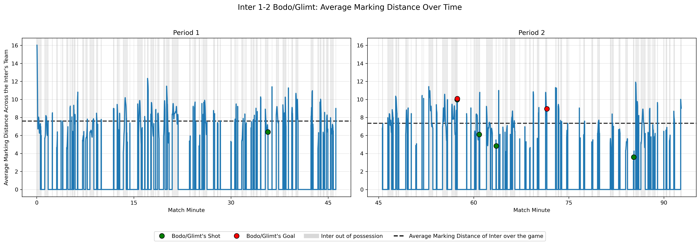
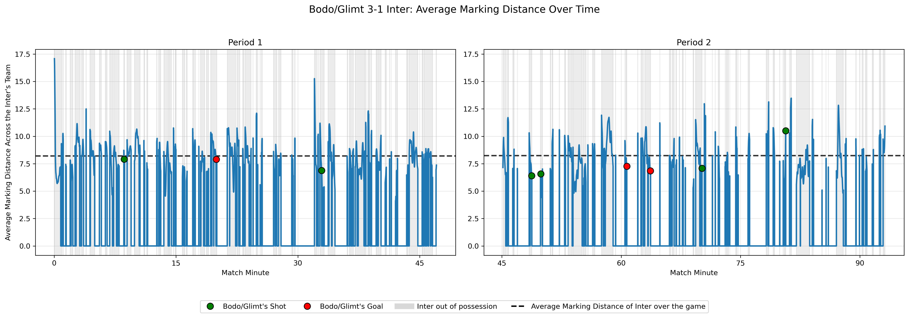
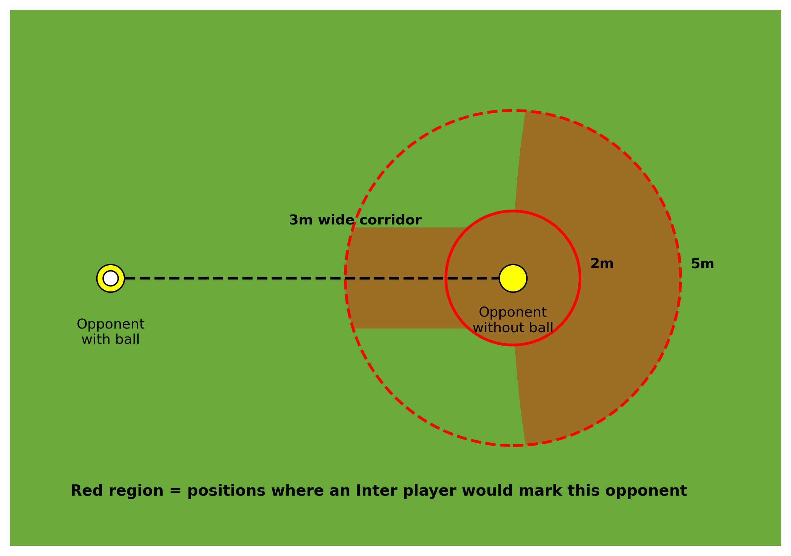
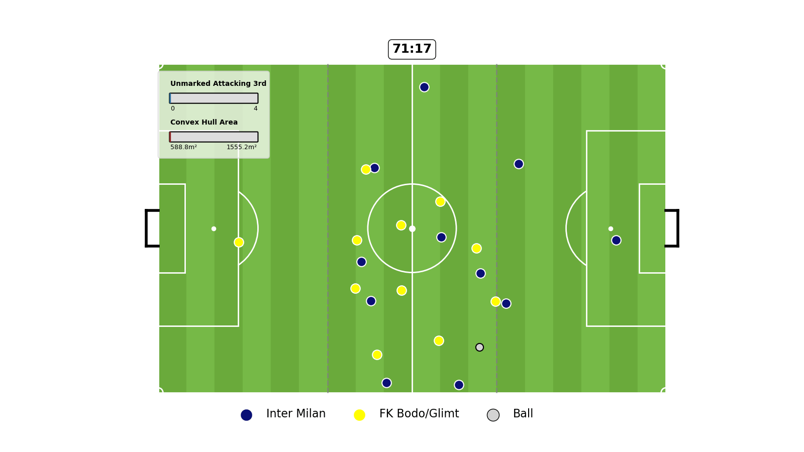
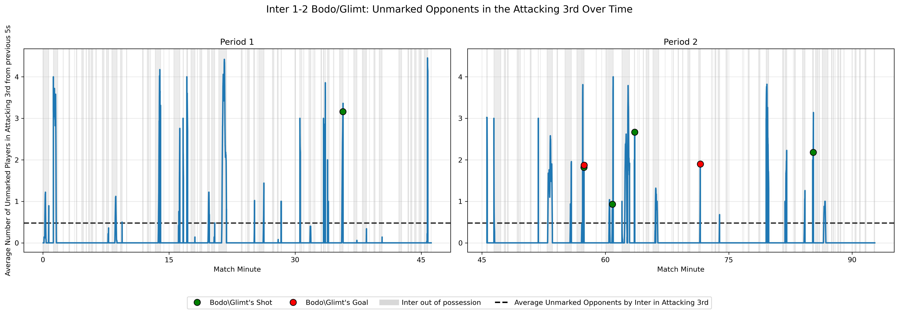
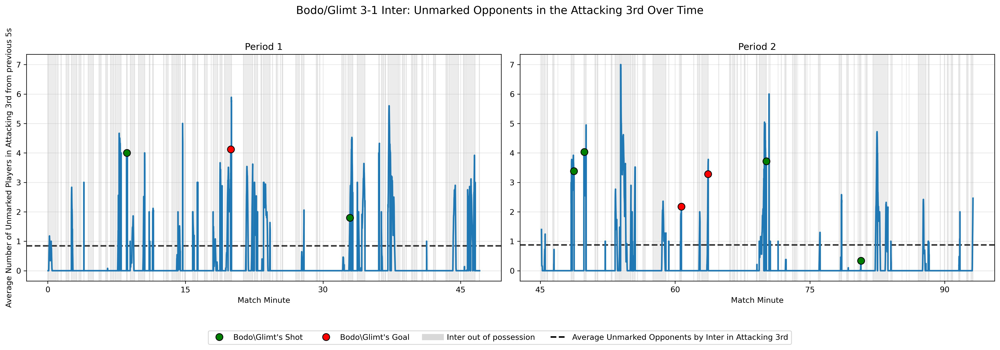
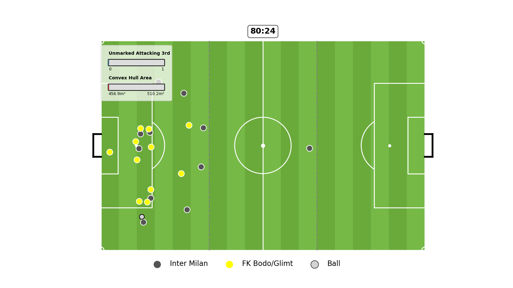
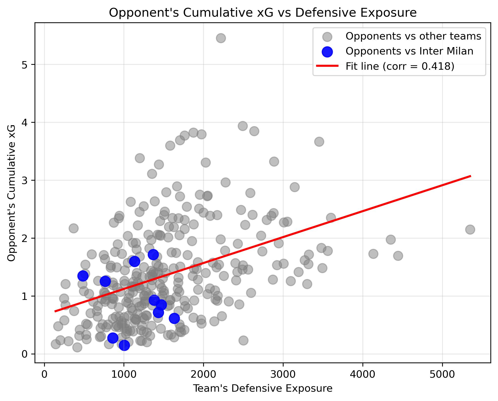
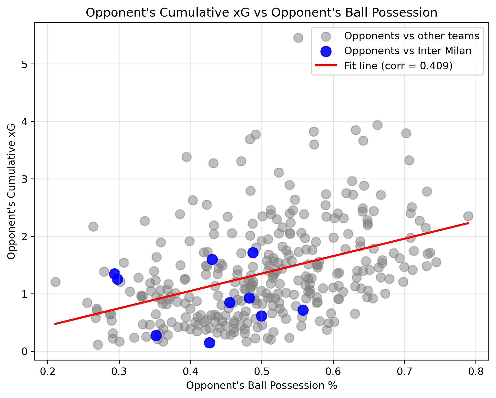
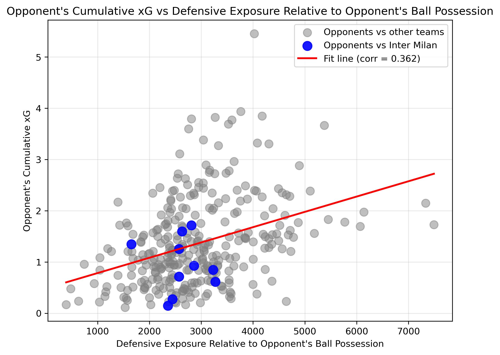

## Marking Analysis of Inter Milan in 2025-26 Champions League

In this project, I analyzed Inter Milan's defensive performance through the lenses of out of possession marking. In particular, I propose a specific definition of marking and a measure for overall exposure to opponent's attacks. I also analyze some of the conceded goals by Inter and attempt to gain data driven insights about what led to them in terms of poor team marking.

### Oversimplified Model: Motivation for My Marking Definition
I began my analysis considering an, arguably oversimplified, model for marking; which I call "MCFP Matching". In this simple approach, I do the following:
<table>
  <tr>
    <td width="55%" valign="top">

1. I only consider the tracking data from skillcorner for the times when Inter is out of possession, which are the frames where either the tracking data specifies the opposing team as being in possession of the ball or the frames corresponding to _ball_possession_ events of the opposing team in the dynamic events dataset.

2. For each frame individually, I solve a minimum-cost flow problem (MCFP) with the cost being the relative distances between the players of Inter and the opposing team, excluding the goalkeepers since those players are assumed to never be marking any of the opposing player.

3. Ultimately, for each frame I have a one-to-one matching between the players of the two teams, and I then calculate the **average marking distance** across the 10 players; Note: there were no red cards in any of the Inter 2025/2026 Champions League games, thus there is always a one-to-one mapping.
    </td>
    <td width="45%" align="center" valign="top">
      
        
      <em>MCFP Matching with player distances as costs (Image taken from the Lecture Slides)</em>
    </td>
  </tr>
</table>

Using this MCFP Matching Marking approach, I consider the games between Inter and Bodo/Glimt to try to understand what led to Inter's defeat, and ultimately the end of their Champions League campaign. However, as it becomes apparent the average marking distance is not a reliable metric. Consider for example the goal giving Bodo\Glimt their 1-0 lead in the away game in Milan:

 
<em>First Goal of Bodo\Glimt in their 2-1 win in Milan</em>

I pose the following questions:

- Is the marking distance of the players outside Bodo\Glimt's attacking third part of the pitch relevant?
- Can a player even be considered marked if the marking distance is high, e.g. above 5m?
- Even if the Inter's player is within the 5m of Bodo\Glimt's player, can the opponent be considered marked if he's closer to Inter's goal?

Since I believe all the answers to the above questions to be **No**, I improve the marking approach in the next [subsection](#improved-marking-definition). However, before moving on, let's further convince ourselves that the average marking distance using MCFP Matching Marking is NOT a statistic I should focus on. For every frame where Inter is not in possession, I have the average marking distance. Then, for each frame, I consider all the frames within the previous 5s where Inter was not in possession and calculate the mean value of those average marking distance. I do that since I are interested in exploring the relationships between average marking distance and the shots/goals of the opposing team. I take the mean of the previous 5s to reduce noise and since taking a shot/scoring a goal is more likely to depend on the marking distances within the last 5s than only its value at the moment of the shot; intuitively, larger marking distances for extended time window can potentially lead to dangerous goal opportunities.

 

As it becomes evident from the graphs above, there is no clear correlation between Inter's out of possession marking distance and opponent's goal scoring opportunities. Keep in mind that the 0's on the above graph correspond to Inter being in possession, so I should not conclude "large" marking distances (peaks on the graph) lead to shots of the opposing team. In particular, when comparing the average marking distance for the shots (green and red dots) against the mean of average marking distances across the whole game (black horizontal dashed line) when out of possession, so excluding the 0's on the graph, I notice that some shots/goals occur when marking distances are above the mean, while others happen when those are below the mean. Since there is no clear correlation, I aim to improve my marking definition to better understand what leads to goal scoring opportunities

### Improved Marking Definition

I motivate my improved marking definition by the questions posed in the previous [subsection](#oversimplified-model-motivation-for-our-marking-definition). I now consider marking in the following way:

<table>
  <tr>
    <td width="40%" valign="top">

1. Same as in the MCFP Matching Marking, I only consider the tracking data from skillcorner for the times when Inter is out of possession, obtained as above.

2. For each frame individually, I solve a minimum-cost flow problem (MCFP) with the cost being the relative distances (+ penalty of 10 000m if the conditions on the right are not satisfied) between the players of Inter and the opposing team, excluding the goalkeepers since those players are assumed to never be marking any of the opposing player.

3. Ultimately, for each frame, for every player from Inter's team, I check which players of the opposing team he can potentially mark by checking if the condition on the right is satisfied. If the opponent does not satisfy those conditions with respect to any of the Inter player's, or all Inter players for which the condition is satisfied are assigned to other opponents by the MCFP algorithm, that player is considered **unmarked**.

4. At the end, for each frame, I are only interested in the number of unmarked opponent's that are in their own attacking third part of the field.
    </td>
    <td width="55%" valign="top">
      
        
Player A can mark Player B (from the opposing team) only if one of the following situations hold:  
-  Player A is within 2 meters distance of B OR
-  Player A is within 5 meters distance of B AND:
    -  Player A is closer to its own goal than B OR
    -  Player A is on the 3m wide corridor between the ball and Player B

_Note 1_: If Player A doesn't satisify those conditions with respect to Player B, it has a an additional distance of 10 000m, and if such assignment is made in Step 2, it is considered as a Player B being unmarked, and Player A not marking any player. I add this large penalty to make sure that such assignment is only being made if Player A cannot mark any unique player from the opposing team.

_Note 2_: On the Image above, the own goal of the defending team is assumed to be on the right hand side.
    </td>
  </tr>
</table>

Firstly, I allow for each player to mark at most one player from the opposing team at a time. Since I are focused on the number of unmarked players in the attacking third of the opposing team, I believe that a single player being able to properly mark more than one player in that dangerous area to be rather ambitious and not realistic. Thus, even if there are multiple opposing players within the marking area of the inter player, I want to treat it as being evenly dangerous as if only one of those players is being marked.

I specify the tight marking threshold as 2m since I believe that any player within that radius of the opposing player can adequately react to their movements and has a large chance of intersecting their passes or shots.

Moreover, in football the defensive line often does not aim to achieve tight one-to-one marking, even in the attacking third. Instead, it can be advantageous to remain a bit further away, but still relatively close (e.g. within 5m), while being closer to ymy own goal, thus protecting it from the opponent. 

Lastly, whenever the player is on the line between the ball and an opponent, I can also consider the opponent marked since that passing opportunity is most likely not viable. I still require the player to be within 5m distance of the opponent, since otherwise the player with the ball could potentially pass the ball in the air over the defender. I consider a 3m wide corridor between the ball and the opponent to be a reasonable choice, since any defender in that area has a high change of intersecting the pass by lunging or jumping. This condition also allows us to consider marking the strikers who often remain at the offside position up until shortly before the pass, which is when they drop onside. In that case, those offside players can be considered marked if the defender is on that specified corridor or simply within 2m of the striker.

 
<em>First Goal of Bodo\Glimt in their 2-1 win in Milan</em>

This new marking definition allows us to gain much more insights about the opponent's goal scoring opportunities. Let's again consider the first goal scored by Bodo\Glimt in their win while playing away in Milan. The whole attack begins with Inter defender's (Akanji) mistake who losses the ball when under pressure of two opponents. Importantly, after losing the ball, the defender does not retreat towards their goal but remains in the same place, eventually not marking any of the opposing players for the remainder of the attack. One Inter player runs back to try to stop the dangerous play, but he is surrounded by three Bodo\Glimt players; thus he manages to mark only one player at a time, leaving the other two unmarked. This situation further explains my reasoning for assuming that a player can only mark at most one opponent at a time. Even though at the later stage of the attack, an Inter player (Zielinski) is relatively close to 3 of the attacking opponents, it is unreasonable to think he is marking all of them well at the same time. Of course in this attack, I can easily notice that it was the defender's mistake of losing the ball that led to this dangerous goal scoring opportunity. However, the more direct reason of scoring the goal, which is closely linked to the sudden loss of possession, is that throughout the attack there were two unmarked players of Bodo\Glimt in the attacking third of the pitch. One could argue that if after losing the ball all three opponents were marked, then there would potentially be no initial shot at the goalkeeper, or that the ball wouldn't have reached the goal scorer after the rebound from the goalkeeper. Thus, in this case the number of unmarked players in the attacking third seems to explain well why the goal was scored.

<!--Lost ball, defender doesnt go back, one defender against 3 (good that I did it so he can mark only 1; 2 unmarked players most of the time in attacking third: goal); Convexhull area doesnt go down potentially because the position of forward players is extrapolated and the model incorrectly predicts they continue running forward-->

 
<em>Second Goal of Bodo\Glimt in their 2-1 win in Milan</em>

Let's now consider the second goal that Bodo\Glimt scored in that same match. First of all, I can realize that throughout the whole attack, Bodo\Glimt passes their ball to an unmarked (at the moment of the pass) player. This of course shows that teams usually choose unmarked players to pass to so that the passes cannot be intercepted in time. Actually, the initial pass of the Inter player after which they lost ball possession was directed to a player marked by a Bodo\Glimt's right back, which can explain why that pass was intercepted and led to loss of ball possession. If you look closely, the player who eventually scored a goal for Bodo\Glimt was initially marked by a player of Inter (Dimarco), however that player did not run back to defend their goal leaving the striker unmarked for enough time for him to score a goal. While at the later stages of the attack the goal scorer is considered marked by a defender, I could argue that if Dimarco ran back with him, thus making that Bodo\Glimt player marked the whole time, there would have potentially been no goal scored. Moreover, I can notice that for a large proportion of the attack there is at least 2 unmarked players of Bodo\Glimt in the attacking third, and at some point all of their 4 players in the attacking third are unmarked. Thus, the player assisting had potentially 3 different unmarked players in the attacking third to pass to; naturally, he chooses the one closest to the goal with the best goal scoring opportunity. Moreover, in terms of the convex hull created by Inter's outfield players, I can notice that at the moment Inter loses ball possession, its area is at the maximum (approximately 1500 m²). That is of course since during attacks players spread out wide around the pitch to make themselves available for a pass. Within 7 seconds of the lost possession, Inter's convex hull area decreases drastically to approximately 600m² as almost all the players run back towards the middle of the field to try to intercept the counterattack. This shift showcases the common approach to defending which aims to make the area in front of the goal more dense with defenders.

<!--Throughout the whole play, the ball is passed to an unmarked player. The defender who is initially marking the scorer of the goal doesn't run back to mark him, leaving him unmarked for enough time to pass him the ball; for a large proportion of time there's at least 2 unmarked players in the attacking third, at some point even 4 (which is all of them). The player assisting had potentially 3 different unmarked players in the attacking third to pass to; naturally he chose the one closest to the goal. The moment inter loses the ball, their convex hull are is the largest, and within 7 seconds it drastically decreases into the minimum as many players run back towards the middle to defend (common tactic as I often want to defend making the area in front of the goal dense).-->

From the analysis above, I can see that when Bodo\Glimt scored their two goals in Milan, they had multiple unmarked players in the attacking third. However, is there a general relationship between having goal scoring opportunities (shots) and unmarked players in the attacking third? To establish that, I consider a similar method to the previous [subsection](#oversimplified-model-motivation-for-our-marking-definition). For every frame where Inter is not in possession, I have the number of unmarked opponents in the attacking third. Now again, for every such frame I consider all the frames within the previous 5s where Inter was not in possession and calculate the mean value of those unmarked opponents numbers. My reasoning for taking the mean over a 5s window is the same: taking a shot/scoring a goal is more likely to depend on the number of unmarked players in the attacking third within the last 5s than only its value at the moment of the shot.

 

Note that on those graphs, 0's correspond to moments of the game where either Inter was in possession (non-grey background) or Bodo\Glimt was in possession but they had no unmarked players in the attacking third. It is evident that during both of the games between Inter and Bodo\Glimt (almost) all the shots taken by Bodo\Glimt occurred at the moments of the game with large mean number of unmarked players in the attacking third within the past 5 seconds. Here, I consider values to be large by comparing them to the average across all the frames were Bodo\Glimt was in possession (black horizontal dashed line). Understandably, not every time there were multiple unmarked players in the attacking third, there was a shot by Bodo\Glimt. This can perhaps be explained by poor decision making of the attackers, inaccurate passing, or simply noise in the tracking data.

Notice how I mentioned that almost all the shots by Bodo\Glimt were preceded by large number of unmarked players in the attacking third. In the game, when Inter was playing away, the last shot of Bodo\Glimt stands out as having the number of unmarked players below the mean.

 
<em>Last Shot of Bodo\Glimt in their home 3-1 win against Inter Milan</em>

As I can see above, the counter attack of Bodo\Glimt began after recovering ball possession while defending their goal deeply inside their defending third. This explains why there is not many Bodo\Glimt players in the attacking third in the 5s time window before the shot. I notice that the attacking player shooting on goal was being marked by an Inter player for most of the time, including the moment of the shot. This together with a tight shooting angle explains why the situation didn't pose a threat to the goalkeeper who ultimately caught the ball.

### Relationship between Defensive Exposure and Opponent's Cumulative Expected Goals

While it is evident from analysis above that there is a positive relationship between the number of unmarked players in the attacking third within the 5s time window and the attacker taking a shot, you might be wondering whether there is a relationship with how dangerous the situation is. In particular, if an attacking team has often many unmarked players in the attacking third throughout the game, is it correlated with a high cumulative expected goals of the team? 

To explore that potential relationship, I utlize both skillcorner and statsbomb data for all league phase and playoff games of the 2025/2026 Champions League. When explaining the methodology, I refer to Team A and Team B as the two teams in the considered game. For each game I do the following procedure:

For the skillcorner data:

1. For both of the teams involved in a game, I consider their out of possession defending. For each frame when a given team is out of possession (specified as before using the skillcorner tracking and events data), I run the improved marking algorithm from the previous [subsection](#improved-marking-definition). Ultimately, for each frame where team A is out of possession, I recover the number of unmarked players of team B in team B's attacking third; and vice versa.
2. I define and calculate the **Team's Defensive Exposure metric** for both teams in a given game:
$$
\text{Defensive Exposure}_A = \sum_{i\text{: frame where team A is defending}}\text{Nr of Unmarked Opponents in Attacking Third} \cdot 0.1
$$
The intuition for the formula is the following. I want to explore how often and how many players were left unmarked by team A in their own defending third. For that I could graph the number of unmarked players over the game as time progresses (as I did in the previous [subsection](#improved-marking-definition) on [these](#markingovergame) graphs but now without taking the 5s mean) and simply calculate the area under the curve. In that case, the graph consists of rectangles of height equal to the number of unmarked opponents in team B's attacking third and width of 0.1 since skillcorner tracking data is collected every 0.1s. Thus, the Defensive Exposure of team A is the area under the described graph, with larger values corresponding to having more situations with larger numbers of unmarked players in team A's defending third.
3. Thus, in the end for every game I recover two values corresponding to Defensive Exposures of the involved teams.

For the statsbomb data:

1. For every game, for both of the teams involved, I recover the shots they took with the associated shot expected goal. I exclude the penalties since they would influence the total game expected goals greatly without being directly relevant to marking. For example, if there is no attackers left unmarked but the defender makes a mistake of fouling in the penalty area that would lead to a penalty corresponding to a very large expected goal, however, that would have nothing to do with team's marking.
2. Importantly, I adjust for multiple shots being taken within a single team possession such that I don't have an expected goal of a possession exceeding 1. This adjustment is called by statsbomb as [Cumulative Expected Goals](https://support.hudl.com/s/article/cumulative-expected-goals?language=en_US&topic=Statsbomb_Global_Football_Data_Glossary), but since its not included in the event data, I calculate it ourselves. Consider as an example the first goal Bodo\Glimt scored against Inter while playing in Milan (see the previous animation [here](#firstbodogoalanim)). The initial shot of the striker had an xG of 0.44 but was defended by the goalkeeper. The ball rebounded to the goal scorer whose shot had an xG of 0.74. The sum of these is $0.44+0.74=1.18$, however intuitively "the maximum actual goal value of any single attacking possession is of course 1 goal", as described by statsbomb. So instead I do the following:
$$\mathbb{P}(\text{goal scored}) = 1 - \mathbb{P}(\text{no goal scored}) = 1-(1-0.44)\cdot(1-0.74)=0.85
$$
After doing this procedure for the whole game, I sum the associated probabilities for each team separately, and call the resulting values **Cumulative xG**.
3. Lastly, I also calculated the **ball possession %** split between the two teams involved in each game.  I did so by counting the number of passes (not necessarily completed) of each team, and then dividing by the total number of passes in a game. This is a commonly used approach for estimating the ball possession split by the football analysts. In other words,
$$\text{Ball possession }\%_A=\frac{\text{nr of passes of team A}}{\text{total number of passes across both teams in the game}}$$

To summarize, for every game I have the Defensive Exposures, ball possessions %, and Cumulative xG for both of the teams individually. I want to explore whether the Defensive Exposure of Team A is correlated with the Cumulative xG of the opposing Team B. I are also interested in whether there is a relationship between the ball possession % of Team B and Cumulative xG of Team B. 

_Note:_ Using the explanation above, on the graphs team below A is referred to as "other teams" and "Inter Milan", while team B is referred to as the "opponent". Of course, since every game is considered from perspectives of both teams, each game corresponds to two points on each of the graphs. Since I are especially interested in defensive performance of Inter Milan, I highlight in blue the points corresponding to Inter Milan being the Team A. Specifically, on the left graph the blue points state the defensive exposure of Inter Milan against the cumulative xG of its opponents.

<table align="center" width="100%">
  <tr>
    <td align="center" width="46.5%">
      
    </td>
    <td align="center" width="45%">
      
    </td>
  </tr>
</table>

As I can see on the left graph, there is a moderate correlation of 0.418 between the Team B's Cumulative xG and Team A's Defensive Exposure. However, considering only the games of Inter, namely Inter's Defensive Exposure and Inter opponent's Cumulative xG (blue points), there seems to be no clear trend. Similar observations can be made regarding the correlation of 0.409 between the Team B's Cumulative xG and ball possesion %. In this case, the blue points correspond to the games of Inter and their values are for the Inter's opponents in those matches. Again, in the games that Inter played, there is no clear relationship between their opponent's ball possesion % and the opponent's cumulative xG. However, it is worth noting that I have only 10 observations for Inter since they (sadly) played only this many games in the 2025/2026 Champions League. Thus, expecting a clear trend based on those 10 observations only is too ambitious. 

Intuitively, I expect the Defensive Exposure of Team A to be positively related to the ball possession % of Team B.  Indeed, if team B has the ball most of the game, it is more likely for it to be many situations throughout the game where their players are left unmarked in the team A's defending third, leading to large Defensive Exposure of Team A. This possible relationship explains the correlation between the two variables of 0.79. Thus, even though I found positive correlations of both the Defensive Exposure of Team A with respect to Cumulative xG of Team B, and ball possession % of Team B with respect to Cumulative xG of Team B, it could be that after accounting for the effect of ball possession % on the Cumulative xG, the effect of Defensive Exposure is insignificant. Thus, I now aim to explore whether that is the case.

<table align="center" width="100%">
  <tr>
    <td align="center" width="50%">
 
 
      
    </td>
<td valign="top" width="50%">

OLS regression results of Opponent's Expected Goals excluding penalties on Opponent's Ball Possession and the team's total defensive exposure

| Variable | Coef. | Std. Err. | p-value |
|---|---:|---:|---:|
| Constant | 0.1666 | 0.197 | 0.398 |
| Ball Possession | 1.5469 | 0.550 | 0.005 |
| Defensive Exposure | 0.0003 | 7.89e-05 | 0.001 |

_Note: White heteroskedasticity-robust standard errors;
    R² = 0.191; Sample size = 320._
  </tr>
</table>

I first attempt at answering that question by fitting an OLS estimator in the linear regression of team B's cumulative xG on team B's ball possession % and team A's defensive exposure. In this case, the coefficient for the defensive exposure should be understood as the linear effect on cumulative xG that is not linearly explained by the ball possession %. The p-value of the effect of defensive exposure is 0.001 < 0.05, thus meaning I can reject the null hypothesis of no effect. In other words, defensive exposure of team A seems to explain parts of the cumulative xG value of team B that is not explained by team B's ball possession % alone. It is worth mentioning that this linear model is likely very oversimplified; in reality, there are many factors contributing to the team's cumulative xG with the model being likely highly non linear. Thus, the estimated coefficients should be understood as the best linear approximation of that model. While the coefficient value is not of practical relevance, the significant p-values still suggest the usefulness of using defensive exposure, thus my defined marking definition, in evaluating team's performance in defense.

Moreover, I additionally aggregate team A's defensive exposure and team B's ball possession % into a single metric, by dividing the former by the latter. The resulting values, used on the x-axis on the graph above, correspond to the defensive exposure of team A per 1% of team B's ball possession. I again have a moderate correlation of 0.362 with cumulative xG of team B. This is likely a more meaningful metric than the defensive exposure alone, since the opponent's ball possession % should also be considered given the large correlation between the two. If I only consider the games of Inter and its defensive exposure (blue points), I notice a relatively more pronounced upward trend with a single outlier corresponding to the point with the lowest defensive exposure of Inter relative to the opponent's ball possession % (the left most blue point). In fact, that observation corresponds to the Inter's 1-2 loss to Bodo\Glimt. In particular, that means that in that game, even though there was a small defensive exposure of Inter per 1% of Bodo\Glimt's ball possession, Bodo\Glimt managed to accumulate surprisingly large cumulative xG. If I again inspect the evolution of the number of unmarked players over the game (see the graph above or click [here](#markingovergame)), I notice much fewer peaks compared to Inter's away 3-1 loss with Bodo\Glimt. Those peaks are also considerably smaller with values not crossing the threshold of 5, while in the away game the values crossed it on a few occasions. This explains why this relative defensive exposure is so small. Moreover, the number of Bodo\Glimt's possessions ending with a shot over that game is only 6, which is the second smallest from all the Inter's opponents.

Moreover, after again considering the above animations for the goals scored by Bodo\Glimt in their 2-1 victory (click [here](#firstbodogoalanim) or [here](#secondbodogoalanim)), I notice that both of the goals came from quick counter attacks. Below I can see the xG of all the Bodo\Glimt's shots. I notice that apart from the possessions corresponding to the scored goals, there weren't any other large threats of Inter conceding. Thus, the data suggests that most of the time Bodo\Glimt was in possession of the ball, they didn't pose a threat of scoring on Inter's goal. However, when they did  pose a threat, it corresponded to big counter attack chances with large shot xG, explaining the surprisingly large game cumulative xG, compared to a very small Inter's defensive exposure per 1% of Bodo\Glimt's ball possession.

<table align="center">
<tr>
<td align="center">

<em>Table of all the shots of Bodo\Glimt in their 2-1 victory against Inter Milan</em>

<table>
<tr>
<th>Minute of the Game</th><th>Possession Id</th><th>Shot xG</th><th>Possession xG</th><th>Goal</th>
</tr>
<tr><td>35:40</td><td>83</td><td>0.12</td><td>0.12</td><td></td></tr>
<tr><td>57:22</td><td>135</td><td>0.44</td><td>0.85</td><td>(same possession as below)</td></tr>
<tr><td>57:23</td><td>135</td><td>0.74</td><td>0.85</td><td>✓</td></tr>
<tr><td>60:49</td><td>139</td><td>0.09</td><td>0.09</td><td></td></tr>
<tr><td>63:32</td><td>144</td><td>0.04</td><td>0.04</td><td></td></tr>
<tr><td>71:31</td><td>160</td><td>0.23</td><td>0.23</td><td>✓</td></tr>
<tr><td>85:13</td><td>188</td><td>0.02</td><td>0.02</td><td></td></tr>
</table>

</td>
</tr>
</table>

### Conclusions and Limitations

The conclusions of my marking analysis are the following:

- Average marking distance from the oversimplified MCFP Matching Marking considers factors irrelevant for evaluating the danger of the opponent's attack, thus fails to provide valuable insights about the conceded goals of Inter Milan
- Using the improved marking definition, allowing for a possibility of a player to be unmarked, I can conclude that in the games between Inter Milan and Bodo\Glimt nearly all the shots and goals of Bodo\Glimt happened when many of their attackers were left unmarked in the attacking third part of the field
- Defining the team's Defensive Exposure as the cumulative sum of the unmarked opponent's in the team's defending third, multiplied by 0.1s being the frequency of collected data in skillcorner, gives an overall game-team level metric correlated with the opponent's cumulative xG
- Team's Defensive Exposure provides additional insights into the opponent's cumulative xG that are unexplained by the opponent's ball possession %, as suggested by the OLS regression
- Even after accounting for the opponent's ball possession % which is positively correlated with the  other team's Defensive Exposure, I find positive correlation with the cumulative xG
- In the 2-1 loss of Inter Milan to Bodo\Glimt, the Norwegian team has abnormally high cumulative xG given a very low defensive exposure of Inter Milan per 1% ball possession of Bodo\Glimt; further analysis suggests that Bodo\Glimt usually didn't pose much threat to the Inter's goal when in ball possession, however, the few times they did, their shots had large xG

Of course, as in any data analysis, I also faced some limitations and found additional areas of improvement:

- When drawing conclusions about Inter's marking performance, I relied on a small sample of only 10 games
- I recognize that a count of players left unmarked in the attacking third does not provide a full picture of the danger of the situation, since for example a striker having an open goal in front but being an only unmarked player is a considerably more dangerous situation than having more unmarked players near the corner flag
- Thus, an area for improvement would include considering a different area other than the attacking third which would also account for the angle to the goal
- Moreover, I could also allow for multiple defenders to be marking a single opposing player to explore whether there are some possible inefficiencies and propose tactical adjustments

### Code

- $4259 - Code for Animations with the MCFP Matching Marking approach
- $4255 - Code for the Graphs of Average Marking Distance Over Time
- $4261 - Code for the Conditions explaining the New Marking definition
- $4264 - Code for Animations with the New Marking definition
- $4265 - Code for the Graphs of Unmarked Opponents in the Attacking 3rd Over Time
- $4272
    - Code for the Graph of Opponent’s Cumulative xG vs Defensive Exposure
    - Code for the Graph of Opponent’s Cumulative xG vs Opponent’s Ball Possession %
    - Code for the Graph of Opponent’s Cumulative xG vs Defensive Exposure Relative to Opponent’s Ball Possession
    - Code for the OLS regression of Opponent's Expected Goals on Opponent's Ball Possession and the team's total defensive exposure
    - Code for the table of all the shots of Bodo\Glimt in their 2-1 victory against Inter Milan

_Note_: The code was written with the help of ChatGPT

